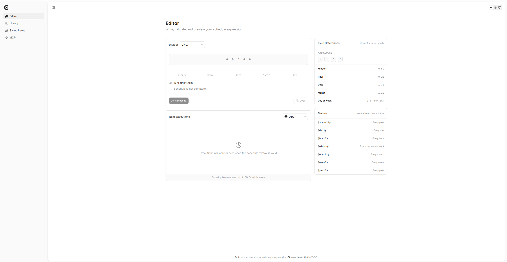
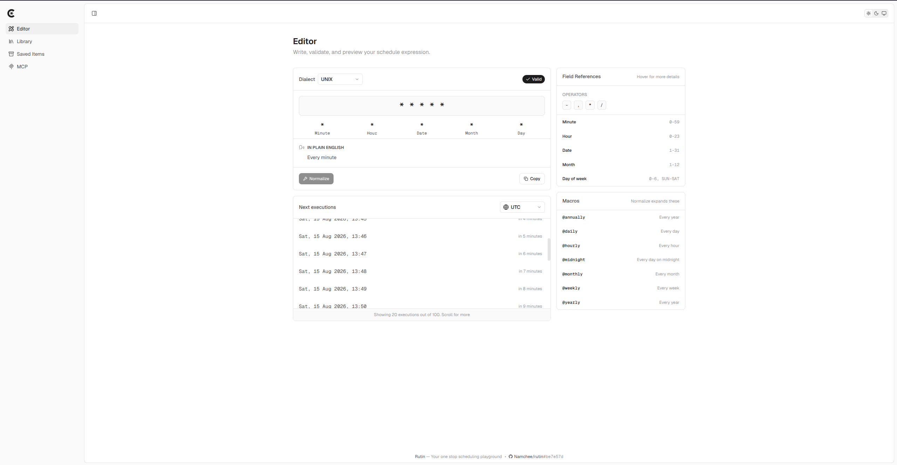
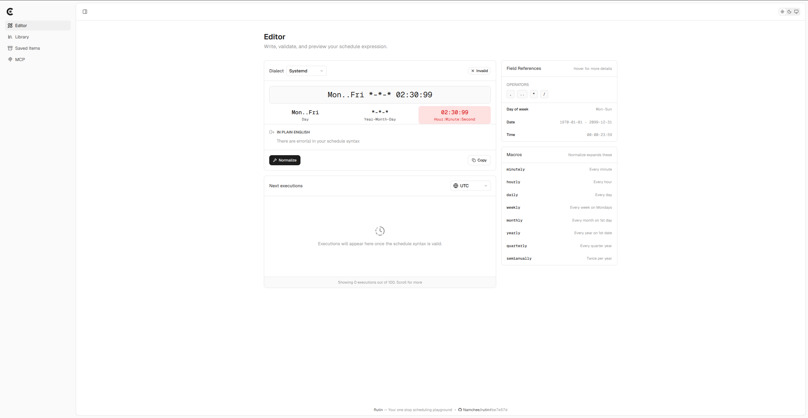
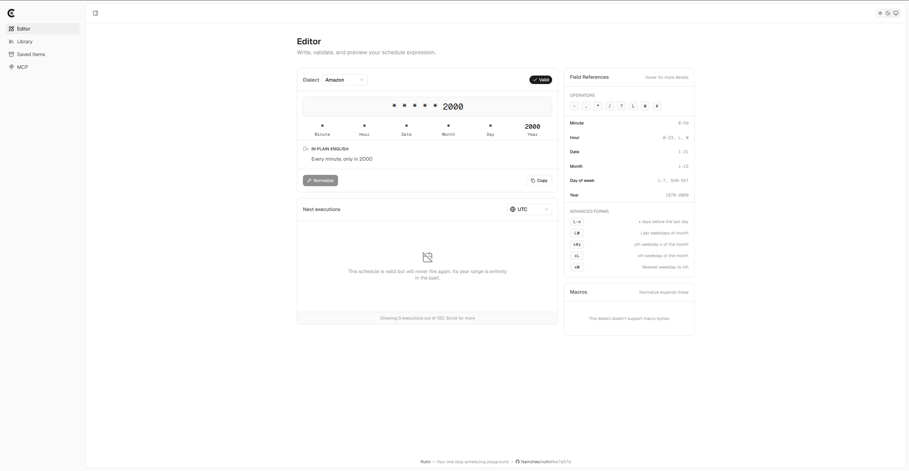
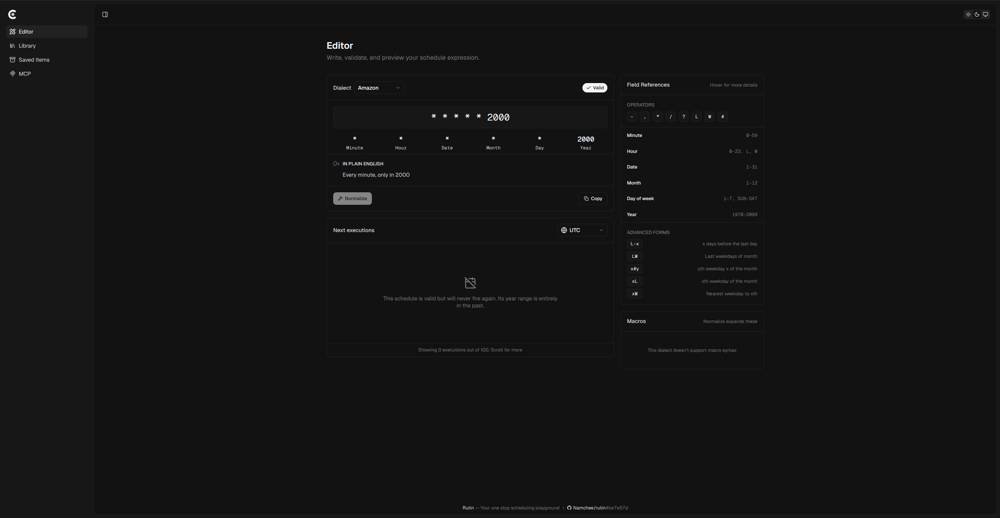

<h1 align="center">
    Rutin
</h1>

    Your one-stop CRON scheduling playground

    
    
    

    
    

## Features

1. **No Nonsense Validation ⚡** Instant feedback on syntax and errors with zero delay.
2. **All Major Dialects Supported 🔥** From standard POSIX to extended syntax (node-cron) and cloud specs (AWS CloudWatch), Rutin handles them all.
3. **Clear Syntax Breakdown 🔍** Explanations for every token, field, and macro so you know how it works.
4. **Execution Run Preview 📅** Preview up to 100 upcoming run dates so you do not trigger a job at 3 AM by mistake.
5. **Auto-Normalization ✨** Format messy expressions into standardized CRON syntax.
6. **Dialect Migration 🔄** Convert expressions between scheduling systems in a single click.

## License

This project is licensed under the [MIT License](./LICENSE)
